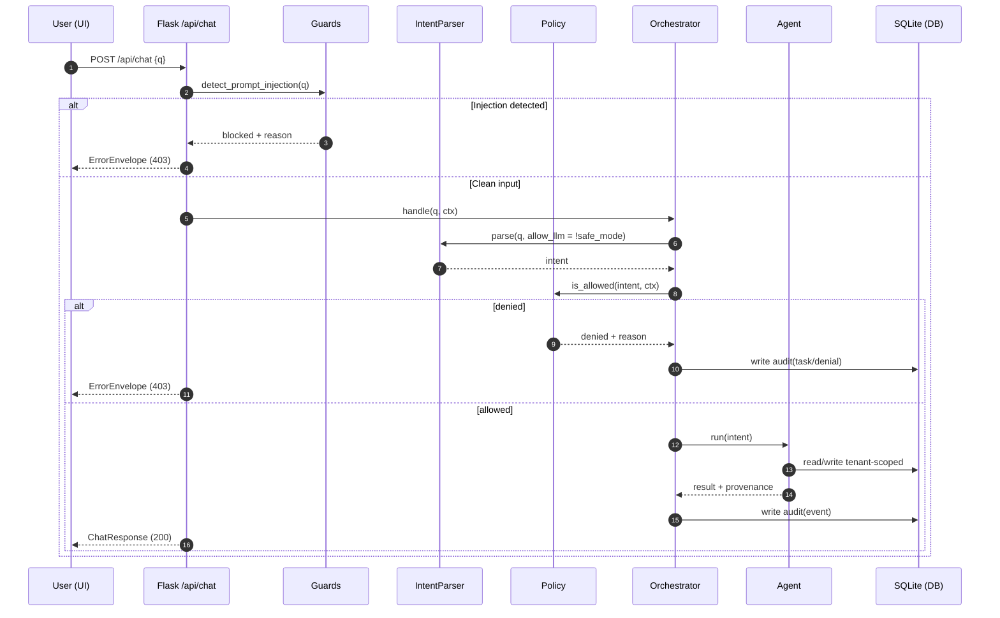
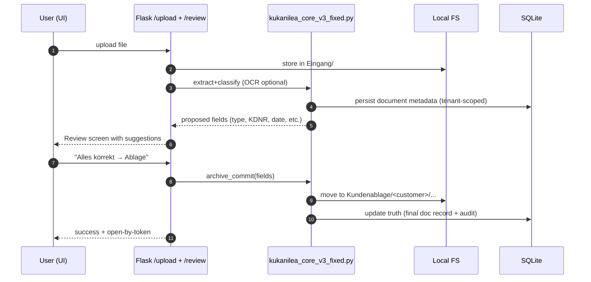

# KUKANILEA Architecture (Local‑First)

**Last updated:** 2026-02-09

KUKANILEA is a **local‑first**, **tenant‑isolated**, **audit‑driven** agent orchestrator for Handwerk workflows.

## Non‑negotiables

- **DB is the source of truth** (SQLite). File system is “reality” (bytes live on disk), but **the DB decides meaning, ownership, and permissions**.
- **Absolute tenant isolation** (no cross‑tenant reads/writes).
- **Deny‑by‑default policy** for every tool/action. Anything meaningful is **audited**.
- **Deterministic API contracts**: every `/api/*` error path returns an **ErrorEnvelope**.
- **Prompt‑injection resilience**: guards run **before** orchestration and before any tool proposal/execution.
- **LLMs are optional tools, never authorities**. **Safe‑mode disables all LLM calls** and keeps behavior deterministic/offline.

---

## System overview

```mermaid
flowchart TB
  %% --- Clients ---
  subgraph C[Clients]
    UI[Web UI (Flask templates + JS)]
    API[HTTP clients (curl / scripts)]
  end

  %% --- App ---
  subgraph A[Flask App]
    W[app/web.py routes]
    AUTH[app/auth.py session + roles]
    ERR[app/errors.py ErrorEnvelope + json_error]
    MW[Middleware: request_id, CSRF, rate limit, timeout]
  end

  %% --- Orchestration ---
  subgraph O[Orchestration]
    ORCH[kukanilea/orchestrator/Orchestrator]
    INTENT[IntentParser (allow_llm toggle)]
    POLICY[Policy engine (deny-by-default)]
    GUARDS[Prompt-injection guards]
    AGENTS[Agents: search / summary / customer / mail ...]
    PROV[Provenance tagging]
    AUDIT[Audit log]
  end

  %% --- Storage ---
  subgraph S[Local Storage]
    DB[(SQLite: instance/*.db)]
    FS[(Local FS: Eingang / Pending / Kundenablage / Done)]
    IDX[Index tables (FTS + metadata)]
  end

  UI -->|/api/*| W
  API -->|/api/*| W

  W --> ERR
  W --> AUTH
  W --> MW
  W --> ORCH

  ORCH --> GUARDS
  ORCH --> INTENT
  ORCH --> POLICY
  ORCH --> AGENTS
  ORCH --> PROV
  ORCH --> AUDIT

  AGENTS --> DB
  AGENTS --> FS
  AGENTS --> IDX
  AUDIT --> DB
  AUTH --> DB
  ERR --> W
```

---

## Request lifecycle: Chat (deterministic)



**Key invariants**
- The API response is always either **ChatResponse (200)** or **ErrorEnvelope (4xx/5xx)**.
- All DB writes include `tenant_id`.
- Denials are audited (and may create a “task” for follow‑up).

---

## Document pipeline: Upload → Review → Ablage



---

## Data boundaries & tenant isolation

- **Every table** must have `tenant_id` and every query must constrain by `tenant_id`.
- File system paths are treated as untrusted input; the DB controls what a path *means*.
- UI routes require `session["tenant_id"]` and role checks for sensitive operations.

---

## “Safe‑mode”

Safe‑mode is a context flag (e.g. `ctx.meta["safe_mode"]=True`) that forces:
- `IntentParser.parse(..., allow_llm=False)`
- LLM provider calls to be blocked (provider gating)
- Deterministic fallbacks (rules/regex) only

---

## Extension points

### Add a new agent
1. Implement `kukanilea/agents/<name>.py` with strict input/output schema.
2. Add allowlisted actions in `kukanilea/orchestrator/policy.py`.
3. Add tests:
   - prompt injection guard triggers
   - tenant isolation
   - deterministic error envelopes

### Add a new API surface
1. Update `contracts/openapi.yaml` + JSON schema(s).
2. Implement route in `app/web.py` with `json_error(...)` for all error paths.
3. Add tests verifying ErrorEnvelope and request_id.

---

## Known sharp edges (track in ROADMAP/LOOP)

- Replace `datetime.utcnow()` with timezone‑aware UTC (see warnings in tests).
- Keep generated `instance/*.db-wal` and `*.db-shm` out of Git (dev artifacts).
