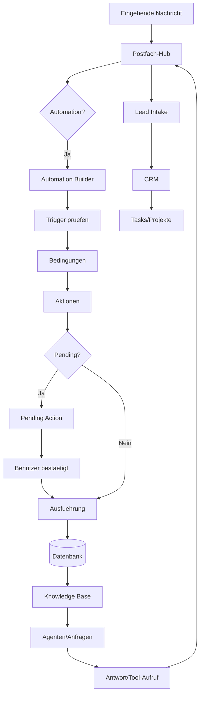

# KUKANILEA Systemhandbuch v1

**Stand (Snapshot):** 2026-02-18  
**Repository:** `/Users/gensuminguyen/Tophandwerk/kukanilea-git`  
**Snapshot-Commit:** Merge von PR #80 (`124b19e`)

Hinweis: Dieses Dokument ist ein Snapshot. Zahlen und Betriebszustaende (Tests, CI, offene PRs, Route-Anzahl) koennen sich nach dem Snapshot-Commit aendern.

## Inhaltsverzeichnis
1. [Einleitung und Vision](#1-einleitung-und-vision)
2. [Architekturueberblick](#2-architekturueberblick)
3. [Datenmodell und Persistenz](#3-datenmodell-und-persistenz)
4. [Mandantenmodell (Tenant-Isolation)](#4-mandantenmodell-tenant-isolation)
5. [Sicherheitsmodell](#5-sicherheitsmodell)
6. [Funktionsbloecke (Module)](#6-funktionsbloecke-module)
7. [Lizenz- und Betriebslogik](#7-lizenz--und-betriebslogik)
8. [Qualitaet, CI und Engineering-Disziplin](#8-qualitaet-ci-und-engineering-disziplin)
9. [Aktueller Zustand und Ausblick](#9-aktueller-zustand-und-ausblick)
10. [Verantwortlichkeiten pro Modul](#10-verantwortlichkeiten-pro-modul)
11. [Datenflussdiagramm (Mermaid)](#11-datenflussdiagramm-mermaid)
12. [Glossar](#12-glossar)
13. [Pflege und Aenderungsprozess](#13-pflege-und-aenderungsprozess)

## 1. Einleitung und Vision
KUKANILEA ist ein lokal laufendes, mandantenfaehiges Betriebs- und Kommunikationssystem fuer Handwerks- und Service-Teams. Es vereint CRM, Lead-Intake, Postfach, Automationen, OCR/Wissensbasis, Tasks, Zeit und Audit in einer Offline-first-Anwendung auf Basis von SQLite.

**Vision:** Eingehende Informationen (E-Mails, Dokumente) schnell in strukturierte Arbeit uebersetzen - von der Nachricht zum nachvollziehbaren Arbeitsfluss, sicher, auditierbar und ohne Cloud-Zwang.

## 2. Architekturueberblick
- Backend: Python 3.11+ mit Flask (monolithisch, modular strukturiert)
- Datenbank: SQLite (Core-DB + Auth-DB)
- Frontend: Jinja2-Templates, HTMX, Tailwind CSS (kein React/Vue/Alpine)
- Lokaler Server: `127.0.0.1:5051`
- App-Entrypoint: `/Users/gensuminguyen/Tophandwerk/kukanilea-git/kukanilea_app.py`
- App-Fabrik: `/Users/gensuminguyen/Tophandwerk/kukanilea-git/app/__init__.py`
- Konfiguration: `/Users/gensuminguyen/Tophandwerk/kukanilea-git/app/config.py`

Wesentliche Module:
- `/Users/gensuminguyen/Tophandwerk/kukanilea-git/app/agents`
- `/Users/gensuminguyen/Tophandwerk/kukanilea-git/app/automation`
- `/Users/gensuminguyen/Tophandwerk/kukanilea-git/app/autonomy`
- `/Users/gensuminguyen/Tophandwerk/kukanilea-git/app/crm`
- `/Users/gensuminguyen/Tophandwerk/kukanilea-git/app/lead_intake`
- `/Users/gensuminguyen/Tophandwerk/kukanilea-git/app/mail`
- `/Users/gensuminguyen/Tophandwerk/kukanilea-git/app/knowledge`
- `/Users/gensuminguyen/Tophandwerk/kukanilea-git/app/omni`
- `/Users/gensuminguyen/Tophandwerk/kukanilea-git/app/skills`
- `/Users/gensuminguyen/Tophandwerk/kukanilea-git/app/eventlog`
- `/Users/gensuminguyen/Tophandwerk/kukanilea-git/app/tasks`
- `/Users/gensuminguyen/Tophandwerk/kukanilea-git/app/entity_links.py`
- `/Users/gensuminguyen/Tophandwerk/kukanilea-git/app/web.py`
- `/Users/gensuminguyen/Tophandwerk/kukanilea-git/app/api.py`

## 3. Datenmodell und Persistenz
- Core-Schema: `/Users/gensuminguyen/Tophandwerk/kukanilea-git/kukanilea_core_v3_fixed.py` (idempotente Schema-Initialisierung/Migrationspfade)
- Domainentabellen u. a. fuer:
  - Users, Roles, Audit
  - Tasks, Time, Events
  - Customers, Contacts, Deals, Quotes
  - Leads, Claims
  - Knowledge, OCR-Jobs, Policies
  - Automation Rules, Triggers, Conditions, Actions
  - Tags, Entity Links
  - Documents, Versions
  - Tenants
- Auth-DB separat fuer Authentifizierung/Sessions
- Benutzerdaten (macOS): `~/Library/Application Support/KUKANILEA/`

Grundprinzipien:
- TEXT-IDs (UUID) statt Integer-Autoinkrement
- Tenant-Scoping im Datenzugriff
- Eventlog als Audit-Rueckgrat fuer Mutationen

## 4. Mandantenmodell (Tenant-Isolation)
- Kernprinzip: Tenant-bezogener Zugriff (`tenant_id`-basiert)
- Default-Tenant/Fixierung konfigurierbar
- Architekturvorgaben dokumentiert in:
  - `/Users/gensuminguyen/Tophandwerk/kukanilea-git/docs/ARCHITECTURE.md`
  - `/Users/gensuminguyen/Tophandwerk/kukanilea-git/docs/CONSTITUTION.md`

## 5. Sicherheitsmodell
- Read-only-Modus blockiert serverseitig mutierende HTTP-Methoden
- Keine PII in Eventlog/Telemetry
- Secrets/Tokens ueber den bestehenden Verschluesselungsmechanismus mit `EMAIL_ENCRYPTION_KEY` (fail-closed)
- Subprocess-Aufrufe nur kontrolliert (kein `shell=True`, mit Timeouts)
- Timing-sichere Vergleiche fuer sensitive Token-Pfade
- CSRF-Schutz fuer mutierende Web-Requests
- Confirm-Gates fuer kritische Aktionen (z. B. E-Mail-Versand)
- Referenzdokumente:
  - `/Users/gensuminguyen/Tophandwerk/kukanilea-git/SECURITY.md`
  - `/Users/gensuminguyen/Tophandwerk/kukanilea-git/CONTRIBUTING.md`

## 6. Funktionsbloecke (Module)
### 6.1 Lead Intake
- Eingang, Priorisierung, Konvertierung von Anfragen
- Claiming/Screening/Terminbezug ueber Web- und HTMX-Flows

### 6.2 CRM
- Kunden, Kontakte, Deals, Angebote
- Verknuepfung mit Intake und Postfach

### 6.3 Postfach-Hub
- IMAP/SMTP + OAuth
- Threading, Drafts, Sync-Status/Reports
- Sicherheitskanten: TLS-only, fail-closed ohne Key

### 6.4 Automation Builder
- Trigger: Eventlog, Cron
- Conditions: deklarativ, allowlist-basiert
- Actions: Tasks/Followups/Drafts/Mail/Webhook (gemaess implementiertem Snapshot)
- Pending/Confirm: replay-sicher, rollen-/csrf-geschuetzt
- Dry-run, Rate-Limits, Reason-Codes, Import/Export-Guardrails
- Doku: `/Users/gensuminguyen/Tophandwerk/kukanilea-git/docs/AUTOMATION_BUILDER.md`

### 6.5 Knowledge / OCR / Autonomy
- Scanner/OCR/PII-Redaktion/Knowledge-Chunks
- OCR-Jobs mit Status- und Fehlertelemetrie

### 6.6 Tags, Entity Links, Conversations
- Entitaetsuebergreifende Verknuepfung und Navigationsstruktur

### 6.7 Omni-Hub
- Kanalabstraktion fuer eingehende Kommunikation

### 6.8 Skills
- Skill-Registry und CLI-Lifecycle (z. B. add/activate/quarantine)

### 6.9 Agenten- und AI-Schicht
- Orchestrierung ueber Agent-Layer
- Tool-Aufrufe innerhalb klarer Systemgrenzen (Tenant, Confirm, Read-only)

## 7. Lizenz- und Betriebslogik
- Lokale Trial-/Lizenzpruefung (ohne zentrale Online-Validierung)
- Betriebsmodi: write-enabled vs. read-only
- Lizenzstatus in UI/API sichtbar (z. B. Plan/Trial/Grund)

## 8. Qualitaet, CI und Engineering-Disziplin
Lokale Verify-Gates (vor Merge erwartbar):
- `python -m compileall -q .`
- `ruff check .`
- `ruff format . --check`
- `pytest -q`
- `python -m app.devtools.security_scan`
- `python -m app.devtools.triage --ci --fail-on-warnings ...`
- `python -m app.devtools.schema_audit --json`

Pre-Commit/Format:
- Formatter/Lint ueber Repo-Konfiguration standardisiert
- Keine neuen Dependencies ohne ADR/Core-Freeze-Freigabe

CI-Hinweis (Snapshot):
- Lokale Gates koennen gruen sein, waehrend GitHub-CI rot ist (z. B. Runner-/Environment-Abweichungen).
- CI-Status muss immer auf dem jeweiligen Commit/PR separat verifiziert werden.

## 9. Aktueller Zustand und Ausblick
Snapshot (Commit `124b19e`):
- Juenge Merges enthalten Automation-/Mail-/Hardening-Iterationen und CI-Formatabgleich.
- Offene Themen priorisiert ueber PR-Backlog, Security-Hardening und CI-Stabilisierung.

## 10. Verantwortlichkeiten pro Modul
| Modul | Hauptverantwortlichkeiten | Wichtige Pfade |
|---|---|---|
| Lead Intake | Inbox, Priorisierung, Konvertierung | `/Users/gensuminguyen/Tophandwerk/kukanilea-git/app/lead_intake/` |
| CRM | Kunden, Kontakte, Deals, Angebote | `/Users/gensuminguyen/Tophandwerk/kukanilea-git/app/crm/` |
| Postfach-Hub | OAuth, IMAP/SMTP, Drafts, Sync | `/Users/gensuminguyen/Tophandwerk/kukanilea-git/app/mail/` |
| Automation | Trigger/Conditions/Actions/Runner | `/Users/gensuminguyen/Tophandwerk/kukanilea-git/app/automation/` |
| Knowledge/OCR | Scanner, OCR, Redaktion | `/Users/gensuminguyen/Tophandwerk/kukanilea-git/app/autonomy/`, `/Users/gensuminguyen/Tophandwerk/kukanilea-git/app/knowledge/` |
| Tags/Links | Querverknuepfungen | `/Users/gensuminguyen/Tophandwerk/kukanilea-git/app/entity_links.py` |
| Omni | Kanalabstraktion | `/Users/gensuminguyen/Tophandwerk/kukanilea-git/app/omni/hub.py` |
| Skills | Skill-Registry, CLI | `/Users/gensuminguyen/Tophandwerk/kukanilea-git/app/skills/` |
| Agenten | Orchestrierung, Tool-Zugriff | `/Users/gensuminguyen/Tophandwerk/kukanilea-git/app/agents/` |
| Eventlog | Audit-Trail | `/Users/gensuminguyen/Tophandwerk/kukanilea-git/app/eventlog/` |
| Tasks/Time | Aufgaben, Zeiterfassung | `/Users/gensuminguyen/Tophandwerk/kukanilea-git/app/tasks/` |
| Web/UI | Routen und Templates | `/Users/gensuminguyen/Tophandwerk/kukanilea-git/app/web.py`, `/Users/gensuminguyen/Tophandwerk/kukanilea-git/templates/` |
| API | Health/Ping/Service-Endpunkte | `/Users/gensuminguyen/Tophandwerk/kukanilea-git/app/api.py` |

## 11. Datenflussdiagramm (Mermaid)

## 12. Glossar
- Tenant: Mandant mit isolierten Datenzugaengen
- Eventlog: auditierbare Mutationseintraege
- Core-Freeze: keine neuen Pakete ohne ADR/Freigabe
- Redaktion: PII-Reduktion vor Persistierung/Indexierung
- Confirm-Gate: serverseitige Bestaetigungspflicht fuer kritische Actions
- Dry-Run: Testausfuehrung ohne Seiteneffekte
- Reason-Code: standardisierte Ausfuehrungsklassifikation

## 13. Pflege und Aenderungsprozess
- Eigentum: Architektur-/Maintainer-Kreis (siehe Teamrollen)
- Update-Regel: Nach groesseren Architektur-, Sicherheits- oder Workflow-Aenderungen
- Mindestinhalt pro Update:
  - Snapshot-Datum + Commit
  - geaenderte Module
  - Security-/Betriebsauswirkungen
  - Verify-Status (lokal vs. CI getrennt)

